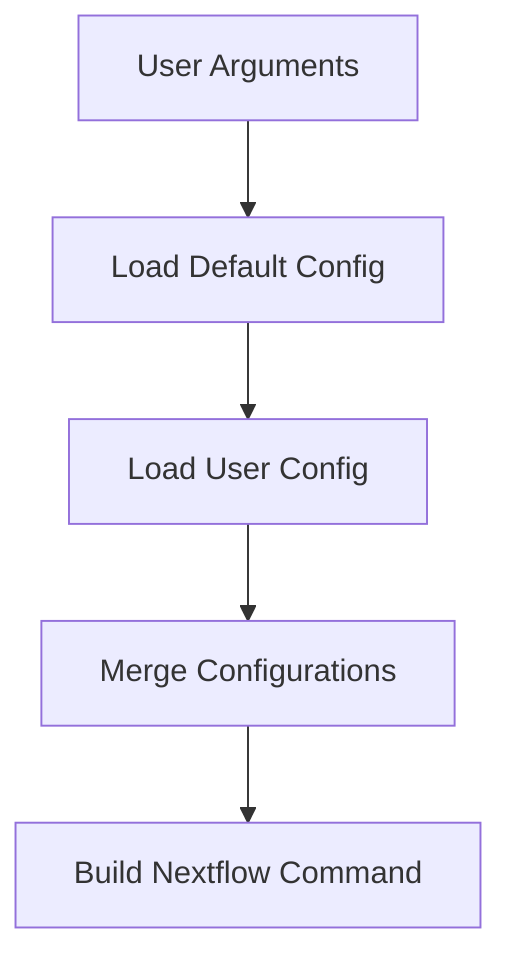

# Architecture Overview

This document describes the technical architecture and design decisions for the MetaGEAR Pipeline Wrapper.

## 🏗️ System Architecture

The MetaGEAR Pipeline Wrapper follows a modular architecture with clear separation of concerns:

```
┌─────────────────┐    ┌─────────────────┐    ┌─────────────────┐
│   User CLI      │────│  Wrapper Core   │────│  MetaGEAR       │
│   (metagear)    │    │   (main.sh)     │    │   Pipeline      │
└─────────────────┘    └─────────────────┘    └─────────────────┘
                              │
                    ┌─────────┼─────────┐
                    │         │         │
           ┌─────────────┐ ┌──────────┐ ┌──────────────┐
           │ Helper Libs │ │ Config   │ │ Installation │
           │ (lib/)      │ │ Mgmt     │ │ (install.sh) │
           └─────────────┘ └──────────┘ └──────────────┘
```

## 📁 Directory Structure

### Core Components

- **`metagear`** - Executable wrapper script (entry point)
- **`main.sh`** - Main CLI logic and command parsing
- **`install.sh`** - Installation and setup script

### Libraries (`lib/`)

- **`common.sh`** - Shared constants, commands, and utilities
- **`workflows.sh`** - Workflow-specific argument building
- **`system_utils.sh`** - System detection and resource management
- **`merge_configuration.sh`** - Configuration file merging logic
- **`workflow_definitions.json`** - Workflow metadata and definitions

### Configuration (`templates/`)

- **`metagear.config`** - Default Nextflow configuration
- **`metagear.env`** - Default environment setup

### Testing (`tests/`)

- **`*.bats`** - Test suites using Bats testing framework

## 🔄 Execution Flow

### 1. Initialization

```bash
metagear workflow_name --input file.csv [options]
```

1. **Wrapper Script** (`metagear`) loads and calls `main.sh`
2. **Environment Setup** sources configuration files
3. **Argument Parsing** validates and processes command line options

### 2. Configuration Assembly



### 3. Pipeline Execution

1. **Nextflow Command Construction**
   - Workflow selection
   - Parameter assembly
   - Profile configuration
   - Resource settings

2. **Pipeline Invocation**
   - Environment preparation
   - Nextflow execution
   - Output management

## 🧩 Component Design

### Core Modules

#### `common.sh`
**Purpose**: Shared functionality and constants

```bash
# Key functions:
- define_commands()      # Command definitions
- check_requirements()   # Dependency validation
- show_usage()          # Help text generation
- validate_input()      # Input file validation
```

#### `workflows.sh`
**Purpose**: Workflow-specific logic

```bash
# Key functions:
- build_workflow_args()  # Parameter construction
- validate_workflow()    # Workflow validation
- get_workflow_info()   # Metadata retrieval
```

#### `system_utils.sh`
**Purpose**: System resource detection

```bash
# Key functions:
- detect_cpus()         # CPU count detection
- detect_memory()       # Memory detection
- get_os_type()         # Operating system detection
```

### Configuration Management

#### Configuration Hierarchy
1. **System defaults** (templates/)
2. **User global config** (~/.metagear/)
3. **Command-line options** (runtime)

#### Merge Strategy
```bash
# Priority (highest to lowest):
1. Command line arguments
2. User configuration files
3. Default configuration
4. System defaults
```

## 🔌 Integration Points

### Nextflow Pipeline Integration

The wrapper interfaces with the MetaGEAR Nextflow pipeline through:

- **Parameter Passing**: Command-line to Nextflow parameter translation
- **Profile Management**: Configuration profile selection
- **Resource Configuration**: CPU/memory/time limit settings
- **Container Management**: Singularity/Docker runtime configuration

### External Dependencies

- **Nextflow**: Pipeline execution engine
- **Container Runtime**: Singularity (preferred) or Docker
- **Bash 4.0+**: Shell scripting environment
- **Standard Unix Tools**: curl, tar, find, etc.

## 📊 Data Flow

### Input Processing

```
Raw Input Files
       │
       ▼
Input Validation
       │
       ▼
Parameter Assembly
       │
       ▼
Nextflow Execution
       │
       ▼
Output Generation
```

### Configuration Flow

```
Default Templates
       │
       ▼
User Configuration ←─── Environment Variables
       │                        │
       ▼                        ▼
Runtime Arguments ──────► Final Configuration
       │
       ▼
Pipeline Execution
```

## 📚 References

- [Nextflow Documentation](https://www.nextflow.io/docs/latest/)
- [Bash Best Practices](https://google.github.io/styleguide/shellguide.html)
- [Container Security](https://docs.docker.com/engine/security/)
- [HPC Integration Patterns](https://hpc.nih.gov/apps/nextflow.html)
